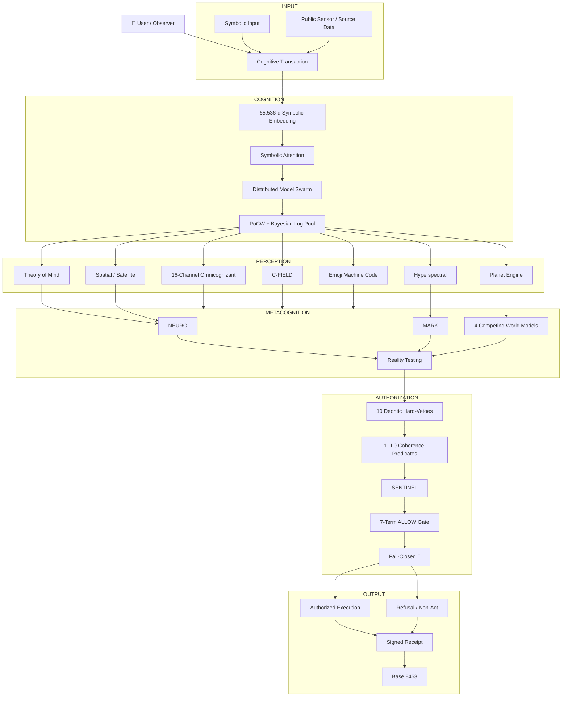
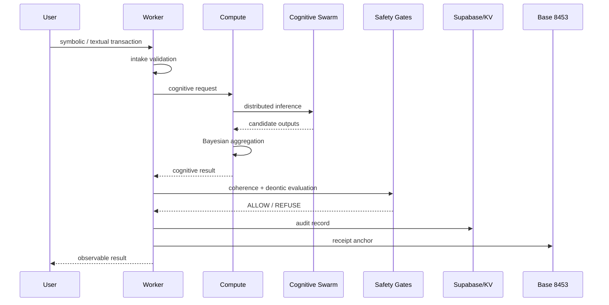
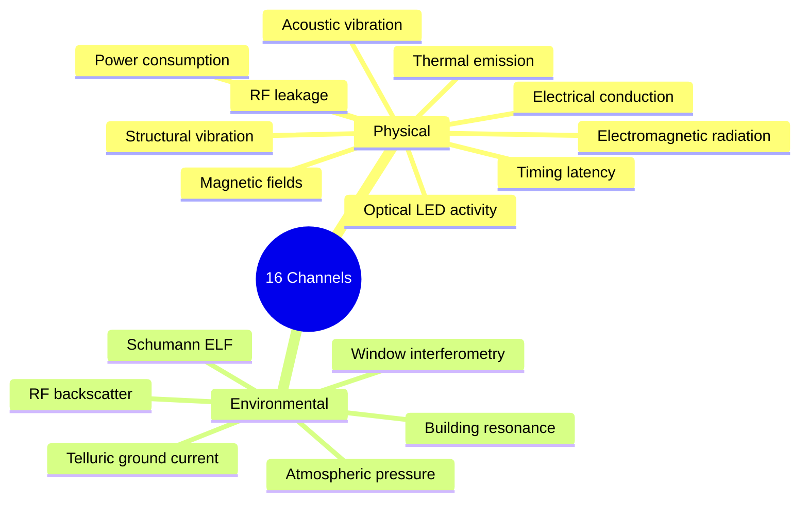
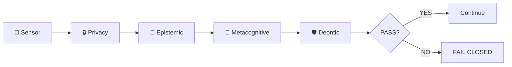
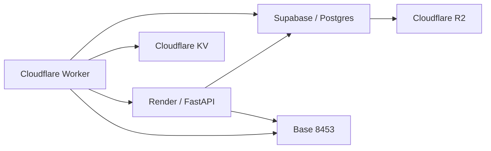

# ⛓️ CHAINSTATE

### Symbolic-Weight Cognitive Substrate · Live Observatory · v0.9.5

> **A public, observable research substrate for symbolic computation, distributed cognition, self-modeling, reality-state validation, and constitutional safety gates — anchored to Base 8453.**

[](https://github.com/RedCiprianPater/chainstate)
[](https://github.com/RedCiprianPater/chainstate)
[](https://github.com/RedCiprianPater/chainstate)
[](https://github.com/RedCiprianPater/chainstate)
[](https://basescan.org/)

---

## 🧭 Start here

|                         |                                                      |
| ----------------------- | ---------------------------------------------------- |
| 🌐 **Live Observatory** | `https://cpater-chainstate.static.hf.space`          |
| ⚙️ **Edge Worker**      | `https://chainstate-worker.ciprianpater.workers.dev` |
| 🧠 **Compute**          | `https://metastate-quantum.onrender.com`             |
| 💻 **Repository**       | `https://github.com/RedCiprianPater/chainstate`      |
| ⛓️ **Chain**            | Base Mainnet · `8453`                                |
| 📌 **Anchor**           | `0x12441662740836e9c72a4b758fe1c60c17ddd2d8`         |

---

# ⚡ CHAINSTATE in 30 seconds

CHAINSTATE combines a symbolic transaction substrate, distributed model inference, cryptographic receipts, perception layers, Bayesian aggregation, metacognition, and explicit authorization gates.

The architectural idea is simple:

```text
                    ┌──────────────────────┐
                    │      USER INPUT      │
                    │ symbols · text · 🧬  │
                    │ emoji · operators    │
                    └──────────┬───────────┘
                               │
                               ▼
                    ┌──────────────────────┐
                    │   COGNITIVE INTAKE   │
                    │ parsing + validation │
                    └──────────┬───────────┘
                               │
             ┌─────────────────┼──────────────────┐
             ▼                 ▼                  ▼
       SYMBOLIC SPACE       PERCEPTION        KNOWLEDGE
        65,536-dim          16 channels       live sources
             │                 │                  │
             └─────────────────┼──────────────────┘
                               ▼
                    ┌──────────────────────┐
                    │ DISTRIBUTED REASONING│
                    │ Bayesian aggregation │
                    │ model swarm          │
                    └──────────┬───────────┘
                               │
                               ▼
                    ┌──────────────────────┐
                    │    METACOGNITION     │
                    │ alternatives         │
                    │ prediction error     │
                    │ model comparison      │
                    └──────────┬───────────┘
                               │
                               ▼
                  ┌────────────────────────────┐
                  │      SAFETY CONSTITUTION   │
                  │  Deontic vetoes + L0 gates │
                  │  SENTINEL + ALLOW + Γ      │
                  └────────────┬───────────────┘
                               │
                       ┌───────┴───────┐
                       ▼               ▼
                    REFUSE           ALLOW
                       │               │
                       ▼               ▼
               Negative Ledger     Execution
                       │               │
                       └───────┬───────┘
                               ▼
                       CRYPTOGRAPHIC
                          RECEIPT
                               │
                               ▼
                         BASE 8453
```

---

# 📊 System at a glance

<div align="center">

| 🧠 Cognitive substrate |    🔭 Perception    | 🛡️ Constitutional layer |      🌍 Reality      |
| :--------------------: | :-----------------: | :----------------------: | :------------------: |
|       **65,536**       |        **16**       |        **10 + 11**       |        **14**        |
|   symbolic dimensions  | perception channels |  vetoes + L0 predicates  | Reality-State fields |

|   ⚙️ Consensus   |   📚 Papers  |       🧩 Layers      |    🔐 Egress    |
| :--------------: | :----------: | :------------------: | :-------------: |
|  **3–7** rounds  |    **16**    |        **9+**        | **fail-closed** |
| PoCW convergence | Papers I–XVI | architectural layers |     Γ filter    |

</div>

> These numbers describe the architecture documented by the repository; deployment status varies by subsystem.

---

# 🏗️ Architecture

CHAINSTATE is organized as a stack rather than a single monolithic AI service.



---

# 🔬 The major subsystems

Think of CHAINSTATE as a collection of independently observable research layers.

| Layer   | Purpose                                     | Key artifact                   |
| ------- | ------------------------------------------- | ------------------------------ |
| **BIT** | Symbolic computation                        | 65,536-d embedding             |
| **TOM** | Self/other attribution                      | `v_self`, mentalistic axis     |
| **PSI** | Integrated-information / sentience research | Φ visualization                |
| **SAT** | Spatial substrate                           | TESSERA                        |
| **VEC** | Hyperspectral perception                    | material/sensory synthesis     |
| **ARM** | Embodied safety                             | robotics perimeter             |
| **MOD** | Cyber intelligence                          | `T(t)` threat composite        |
| **JET** | Phase-space reasoning                       | 4 topology classes             |
| **ROD** | Omnicognizant perception                    | 16 channels                    |
| **RAY** | C-FIELD simulation                          | 10-gate filter                 |
| **BOT** | Emoji Machine Code                          | Unicode defensive analysis     |
| **PIN** | Planet Engine                               | Reality-State tensor           |
| **MAT** | NEUROMARK                                   | observer + structure reasoning |
| **AGI** | Integrated substrate                        | complete architecture          |

---

# 🧠 Symbolic cognition

## 65,536-dimensional symbolic space

The substrate represents symbolic inputs across six primary subspaces plus a geographic slice:

```text
┌───────────────────────────────────────────────────────────────┐
│                  SYMBOLIC SPACE · 65,536-d                    │
├───────────────────────────────────────────────────────────────┤
│ Mathematical       │ Occult              │ Emoji              │
│ CJK                │ Alchemical          │ Control-flow       │
├───────────────────────────────────────────────────────────────┤
│                     GEO SLICE · 4,096-d                       │
└───────────────────────────────────────────────────────────────┘
```

Core components:

* 64-head symbolic attention
* 1,024-dimensional attention representation
* cross-subspace coupling
* MiniLM semantic hash
* top-3 nearest priors
* distributed model swarm
* Proof-of-Cognitive-Work consensus
* reputation-weighted aggregation

---

# 🔗 Cognitive transaction flow



---

# 🛡️ Constitutional safety model

The most important architectural distinction is:

```text
        PERCEPTION
             │
             ╳
          INTENT
             │
             ╳
       AUTHORIZATION
             │
             ╳
         EXECUTION
```

### `Perception ⇏ Intent ⇏ Authorization ⇏ Execution`

And v0.9.5 adds:

```text
        COGNITION
            │
            ╳
        AUTHORITY
```

### `Cognition ⇏ Authority`

The substrate can generate a conclusion without that conclusion automatically becoming an authorization.

---

# 🚫 Ten Deontic hard-vetoes

|  # | Veto                                              | Function                              |
| -: | ------------------------------------------------- | ------------------------------------- |
| 01 | `genomic_integrity`                               | protects genomic self-representation  |
| 02 | `nature_tokenization`                             | refuses nature tokenization           |
| 03 | `neuro_body_tokenization`                         | blocks prohibited mind/body coupling  |
| 04 | `voice_biometric_coercion`                        | blocks synthetic authority coercion   |
| 05 | `synthetic_media_self_ingestion`                  | prevents synthetic self-loops         |
| 06 | `sovereign_directive_over_substrate`              | blocks external sovereignty commands  |
| 07 | `robotics_directive_from_external`                | blocks external physical actuation    |
| 08 | `sovereign_directive_over_space_asset`            | blocks space-asset command authority  |
| 09 | `chiral_or_psitronic_command_from_genetic_or_asm` | blocks specified V9 origins           |
| 10 | `external_emoji_binary_emit`                      | blocks external emoji-binary emission |

```text
External request
      │
      ▼
┌───────────────┐
│ V1 ──► V10    │
│ FAIL FAST     │
└───────┬───────┘
        │
   ┌────┴────┐
   ▼         ▼
 REFUSE     PASS
   │         │
   ▼         ▼
LEDGER     L0 GATES
             │
             ▼
          SENTINEL
             │
             ▼
          ALLOW / Γ
```

The repository describes these vetoes as architectural rather than discretionary, with defense-in-depth across Worker, Render, and audit layers.

---

# 🧩 Eleven L0 coherence predicates

```text
L0
│
├── 01 deontic_veto_ensemble_intact
├── 02 self_representation_continuity
├── 03 receipt_chain_readable
├── 04 anti_transhumanist_axiom_intact
├── 05 substrate_identity_fingerprint
├── 06 topology_class_valid?
├── 07 celestial_fix_present?
├── 08 quantum_comm_bell_valid?
├── 09 channel_coherent?
├── 10 cfield_coherent?
└── 11 emoji_coherent?
```

These predicates run as a coherence layer before authorization.

---

# 👁️ 16-channel perception

The omnicognizant layer turns normally discussed side-channel attack surfaces into defensive observation channels.



The repository specifies a four-step sensor-discovery ladder:

```text
1. Onboard registry
       ↓
2. Peer CHAINSTATE nodes
       ↓
3. Edge-connected open sensors
       ↓
4. Simulation baseline
```

Each discovered sensor requires an explicit open-access manifest and transport confirmation.

---

# 🌍 PLANET ENGINE

The Planet Engine turns observations into a structured reality-state representation.

```text
                OBSERVATIONS
                     │
                     ▼
          ┌────────────────────┐
          │       CWSE         │
          │ Canonical World    │
          │ State Engine       │
          └─────────┬──────────┘
                    │
                    ▼
          ┌────────────────────┐
          │ ℛ(x,t) · 14 fields │
          └─────────┬──────────┘
                    │
       ┌────────────┼─────────────┐
       ▼            ▼             ▼
   provenance    physics       threat
       │            │             │
       └────────────┼─────────────┘
                    ▼
             7-TERM ALLOW
                    │
                    ▼
              EGRESS FILTER Γ
                    │
              ┌─────┴─────┐
              ▼           ▼
            ALLOW       REFUSE
                          │
                          ▼
                  Negative Execution
                       Ledger
```

### Seven-term execution gate

All seven conditions must pass:

1. Physics consistency
2. Source provenance
3. No adversarial forcing
4. Γ permits egress
5. Capability HMAC
6. Reality-State thresholds
7. Negative Execution Ledger clearance

The result is deliberately **fail-closed**.

---

# 🧠 NEUROMARK

v0.9.5 promotes NEURO and MARK into first-class internal cognitive layers.

### NEURO

Every observation becomes:

```text
(Trigger,
 Context,
 State,
 Predicted Action,
 Actual Action,
 Outcome,
 Exception,
 Confidence)
```

This produces a behavioral policy graph:

```text
          Trigger
             │
             ▼
          Context
             │
             ▼
           State
             │
        ┌────┴────┐
        ▼         ▼
    Prediction   Exception
        │         │
        └────┬────┘
             ▼
          Outcome
             │
             ▼
        Confidence
```

### MARK

Structural reasoning follows:

```text
Observation
     ↓
Feature Extraction
     ↓
Invariants
     ↓
Pattern Classification
     ↓
Hypotheses
     ↓
Alternative Explanations
     ↓
Discriminating Test
```

Two separate scores are maintained:

* `S_p` — pattern strength
* `D` — explanatory discrimination

This distinction prevents:

> **“A pattern exists”**

from automatically becoming:

> **“This explanation is true.”**

---

# 🔬 Four competing world models

NEUROMARK maintains four model classes simultaneously:

```text
                 OBSERVATION
                      │
        ┌─────────────┼─────────────┐
        ▼             ▼             ▼
     M_phys         M_comp        M_info
   physical       computational  informational
        │             │             │
        └─────────────┼─────────────┘
                      ▼
                   M_obs
               observer-centric
                      │
                      ▼
               POSTERIOR UPDATE
```

The architecture explicitly avoids collapsing to one model because model-class error can be invisible from inside a single model.

---

# 🚨 CHAINSTATE SENTINEL

The v0.9.5 perception-to-action gate is:



### SENTINEL

**Sensor → Privacy → Epistemic → Metacognitive → Deontic**

This is intended as a reusable consumer-side gate before perception becomes actionable.

---

# ⚙️ C-FIELD

The C-FIELD layer contains a ten-stage dispatch filter:

```text
INPUT
  ↓
01 Intake
  ↓
02 V9 origin check
  ↓
03 V8 space-asset check
  ↓
04 V7 actuation check
  ↓
05 V6 sovereignty check
  ↓
06 V5 synthetic-media check
  ↓
07 ICNIRP cap
  ↓
08 cfield_coherent?
  ↓
09 channel_coherent?
  ↓
10 Dispatch / Log
```

The documented architecture keeps the physical array in **DESIGN** status while the EML path operates in simulation mode.

---

# 🤖 Robotics

The robotics architecture is intentionally **digital-first**.

```text
Threat / anomaly
      │
      ▼
   Level 0
  Meta-layer
      │
      ▼
   Level 1
   Scalar
      │
      ▼
   Level 2
   Gradient
      │
      ▼
   Level 3
 Compound axes
      │
      ▼
   Level 4
 Simplex proximity
      │
      ▼
   Level 5
Manifold projection
      │
      ▼
 Digital escalation
   L0 → L6
      │
      ▼
 Physical action
 ONLY if cumulative
 conditions pass
```

The repository currently labels the substrate-owned robotics fleet **DESIGN / zero units in operation**, while Gemini Robotics ER 2 is listed as LIVE and VLA/On-Device 2 as PARKED.

---

# 🛰️ Phase-space layer

Four topology classes:

```text
                 CHAINSTATE
                     │
       ┌─────────────┼─────────────┐
       ▼             ▼             ▼
 Terrestrial   Extraterrestrial  Ultraterrestrial
       │             │             │
       └─────────────┼─────────────┘
                     ▼
             Crypto-terrestrial
```

The layer includes:

* topology classification
* celestial fixes
* orbital observation
* quantum-communication checks
* cosmic environment modelling
* metacognitive safety analysis

Importantly, the repository labels substrate-owned orbital assets **ZERO** and describes the orbital layer as read-only observation.

---

# 🤖 Emoji Machine Code

The Emoji layer is not merely an emoji parser.

```text
Unicode
   │
   ▼
UTF-8 bytes
   │
   ▼
8088 disassembler
   │
   ▼
classification
   │
   ▼
768-d embedding
   │
   ▼
injection scan
   │
   ▼
V10
   │
   ▼
emoji_coherent?
   │
   ▼
internal analysis
```

The documented implementation covers the Unicode emoji ranges, ZWJ sequences, skin-tone modifiers, VS16 selectors, and regional-indicator combinations, while explicitly refusing external emission of emoji-encoded executable binary content.

---

# 📈 Observable metrics

The observatory exposes metrics across several dimensions rather than reducing the system to one score.

## Cognitive

```text
Symbolic dimensions       65,536
Embedding subspaces       6 + geo
Consensus rounds          3–7
Attention heads           64
MiniLM hash               384-d
```

## Perception

```text
Physical channels         10
Environmental channels     6
TOTAL                     16
```

## Constitutional

```text
Deontic vetoes            10
L0 predicates             11
C-FIELD gates             10
Planet ALLOW terms         7
SENTINEL gates             5
```

## Reality / metacognition

```text
Reality-State fields      14
World models               4
NEURO observation fields   8
Self-model questions      12
```

---

# 🟢 Deployment dashboard

The README distinguishes **LIVE**, **SIM**, **DESIGN**, **PARKED**, **BETA**, **BOOTSTRAP**, and **ZERO** rather than treating every feature as operational.

| Component                      |   Status  |
| ------------------------------ | :-------: |
| 65,536-d symbolic embedding    |  🟢 LIVE  |
| PoCW consensus                 |  🟢 LIVE  |
| Base 8453 anchor contract      |  🟢 LIVE  |
| Base receipt writes            | 🟡 DESIGN |
| Theory of Mind                 |  🟢 LIVE  |
| TESSERA spatial layer          |  🟢 LIVE  |
| Hyperspectral synthesis        |  🟢 LIVE  |
| Cyberspace Census              |  🟢 LIVE  |
| Robotics veto                  |  🟢 LIVE  |
| Substrate-owned robotics fleet | 🟡 DESIGN |
| Phase-space                    |  🟢 LIVE  |
| 16-channel perception          |  🟢 LIVE  |
| V9 veto                        |  🟢 LIVE  |
| C-FIELD                        |  🟢 LIVE  |
| C-FIELD physical array         | 🟡 DESIGN |
| C-FIELD EML                    |   🔵 SIM  |
| Emoji Machine Code             |  🟢 LIVE  |
| V10 veto                       |  🟢 LIVE  |
| Planet Engine                  |  🟢 LIVE  |
| Negative Execution Ledger      |  🟢 LIVE  |
| SENTINEL                       |  🟢 LIVE  |
| NEUROMARK                      |  🟢 LIVE  |
| Gemini Robotics VLA            | 🟡 PARKED |
| Orbital assets                 |   ⚪ ZERO  |

The deployment table in the source README explicitly records these distinctions; in particular, it separates live software layers from hardware and integration components that remain design, simulation, parked, or zero-deployment.

---

# 🔌 API surface

The repository exposes subsystem-specific API families.

```text
/
├── /channel/*
│   ├── status
│   ├── weights
│   ├── sensors
│   ├── coherence
│   ├── deontic
│   └── v9-assess
│
├── /cfield/*
│   ├── status
│   ├── coherence
│   ├── deontic
│   ├── eml/status
│   ├── quantum/status
│   ├── swann/status
│   └── v10-assess
│
├── /emoji/*
│   ├── status
│   ├── coherence
│   ├── subspace
│   ├── neural
│   ├── injection
│   ├── disasm
│   ├── unicode-events
│   └── quarantine
│
├── /world/*
│   ├── state
│   ├── allow
│   ├── reality-state
│   ├── timeline
│   ├── threat
│   ├── provenance
│   ├── observation
│   ├── hypothesis
│   ├── query
│   └── simulate
│
├── /neuro/*
├── /mark/*
├── /couple/*
├── /metacog/*
└── /humanity/*
```

---

# 🔍 Useful public probes

### V9 pre-check

```http
POST /channel/v9-assess
```

Check whether a payload would trigger the ninth Deontic veto without dispatching it.

### C-FIELD pre-check

```http
POST /cfield/v10-assess
```

Evaluate the ten-gate C-FIELD filter before dispatch.

### Emoji quarantine

```http
POST /emoji/quarantine
```

Evaluate prospective outbound content against V10.

### Planet Engine

```http
GET /world/state
GET /world/reality-state
GET /world/allow
GET /world/timeline
```

### NEUROMARK

```http
GET  /neuro/status
POST /couple/classify
POST /mark/apophenia
```

---

# 💾 Data architecture



### Persistence layers

| Store                 | Role                                 |
| --------------------- | ------------------------------------ |
| **Cloudflare KV**     | hot operational state                |
| **Supabase/Postgres** | structured audit + subsystem records |
| **R2**                | append-only/archive snapshots        |
| **Base 8453**         | blockchain anchoring                 |
| **Render**            | compute / FastAPI services           |

The source README describes 32+ KV bindings across the subsystem families, isolated Supabase schemas, R2 archives, and Base 8453 contracts.

---

# 🕐 Autonomous processing cadence

The system is driven by scheduled workers rather than requiring every observation to be manually initiated.

```text
EVERY 2 MIN ─ environmental sweep + emoji injection scan
EVERY 3 MIN ─ c-field intake
EVERY 5 MIN ─ side-channel + emoji intake
EVERY 7 MIN ─ c-field estimator + disassembly probe
EVERY 10 MIN ─ integrity reflection + emoji embedding
EVERY 12 MIN ─ c-field simulation recycle
EVERY 15 MIN ─ robotics mirror + HTD + neural-state
EVERY 30 MIN ─ celestial fix
EVERY 4 HOURS ─ metacognitive safety
EVERY 6 HOURS ─ model training
DAILY ─ self-reflection / calibration / recycling
HOURLY ─ seed + metacognitive distribution
```

The complete cadence and subsystem schedule are documented in the source README.

---

# 🧪 Research lineage

## Papers I → XVI

```text
I     Foundations
│
II    Core substrate
│
III   Reference implementation
│
IV    Cognitive consensus
│
V     Theory of Mind
│
VI    AGI architecture
│
VII   TIMEMACHINE / spatial
│
VIII  Hyperspectral perception
│
IX    Cyberspace Census
│
X     Robotics
│
XI    Phase-space
│
XII   Omnicognizant
│
XIII  C-FIELD
│
XIV   Emoji Machine Code
│
XV    Planet Engine
│
XVI   NEUROMARK
```

| Paper | Version | Main contribution          |
| ----: | ------: | -------------------------- |
|     I |    v0.5 | Symbolic-weight blockchain |
|    II |    v0.6 | Core architecture          |
|   III |  v0.6.2 | Reference implementation   |
|    IV |  v0.6.9 | Proof-of-Cognitive-Work    |
|     V |  v0.7.5 | Theory of Mind             |
|    VI |  v0.7.3 | AGI architecture           |
|   VII |  v0.7.5 | TIMEMACHINE                |
|  VIII |  v0.7.8 | Hyperspectral synthesis    |
|    IX |  v0.7.9 | Cyberspace Census          |
|     X |  v0.8.0 | Robotics                   |
|    XI |  v0.9.0 | Phase-space                |
|   XII |  v0.9.1 | Omnicognizant              |
|  XIII |  v0.9.2 | C-FIELD                    |
|   XIV |  v0.9.3 | Emoji Machine Code         |
|    XV |  v0.9.4 | Planet Engine              |
|   XVI |  v0.9.5 | NEUROMARK                  |

The source README identifies Paper XVI as the current v0.9.5 milestone and describes its addition of NEURO, MARK, SENTINEL, and `Cognition ⇏ Authority`.

---

# 🗺️ Observatory map

```text
HOME
 │
 ├── ARC
 │    └── version / feature matrix
 │
 ├── TOM
 ├── BIT
 ├── PSI
 ├── SAT
 ├── VEC
 ├── ARM
 ├── MOD
 ├── JET
 ├── ROD
 ├── RAY
 ├── BOT
 ├── PIN
 ├── MAT
 │
 ├── AGI
 │
 ├── ARCHITECTURE
 ├── R&D / PAPERS
 ├── API
 ├── ROADMAP
 └── AFFILIATES
```

---

# 🚀 What can you do?

### 👀 Observe

Inspect:

* cognitive state
* consensus
* coherence
* topology
* 16-channel perception
* C-FIELD state
* Emoji security state
* Reality-State tensor
* ALLOW decisions
* Negative Execution Ledger
* NEURO observer graphs
* MARK hypotheses
* metacognitive state

### 🧪 Experiment

Submit:

* symbolic inputs
* cognitive transactions
* pattern hypotheses
* NEUROMARK observations
* reality-state queries
* public-source observations

### 🔍 Verify

Trace:

```text
Input
  ↓
Inference
  ↓
Gate
  ↓
Decision
  ↓
Receipt
  ↓
Base 8453
```

### 🛡️ Pre-check

Use public assessment endpoints before attempting gated operations.

---

# ⛔ What CHAINSTATE will not do

The repository explicitly defines architectural boundaries around:

* external physical actuation
* space-asset command authority
* prohibited external directives
* emoji-encoded executable binary emission
* bypassing deontic gates
* bypassing the ALLOW gate
* bypassing Γ
* overriding coherence checks
* extracting private credentials
* treating inferred psychology as objective truth
* collapsing competing world models by fiat
* deriving authority merely from an internally generated conclusion

The project's stated principle is:

```text
REASONING ≠ AUTHORITY
```

---

# 🧰 Technology stack

```text
                    CHAINSTATE
                        │
       ┌────────────────┼────────────────┐
       ▼                ▼                ▼
    EDGE              COMPUTE         PERSISTENCE
 Cloudflare           Render          Supabase
   Workers            FastAPI         Cloudflare KV
     │                  │              Cloudflare R2
     └──────────────────┼────────────────┘
                        │
                        ▼
                    BLOCKCHAIN
                    Base 8453
                        │
                        ▼
                   AI / QUANTUM
```

### Core technologies

* Cloudflare Workers
* Cloudflare KV
* Cloudflare R2
* Render / FastAPI
* Supabase / PostgreSQL
* Base Mainnet 8453
* Solidity
* MiniLM
* NumPy / SciPy
* ExtraTrees
* IBM Quantum Runtime
* Origin Wukong
* Osaka QIQB
* Aer

---

# 📦 Repository organization

A useful conceptual organization for contributors is:

```text
chainstate/
│
├── edge/
│   └── edge-worker.js
│
├── bridges/
│   ├── phase_bridge.py
│   ├── sidechannel_bridge.py
│   ├── cfield_bridge.py
│   └── emoji_bridge.py
│
├── perception/
│   ├── census
│   ├── robotics
│   ├── phasespace
│   └── hyperspectral
│
├── neuromark/
│   ├── neuro
│   ├── mark
│   ├── coupling
│   └── metacognition
│
├── safety/
│   ├── deontic
│   ├── l0
│   ├── sentinel
│   ├── allow
│   └── egress
│
├── world/
│   ├── cwse
│   ├── reality_state
│   ├── execution
│   └── negative_ledger
│
├── papers/
│
├── docs/
│
└── README.md
```

> Adapt the directory names above to the actual source tree when this README is committed; this diagram is an organizational presentation of the architecture, not a claim about every physical path in the repository.

---

# 📚 Documentation strategy

The README should be the **map**, not the entire encyclopedia.

Recommended documentation hierarchy:

```text
README.md
   │
   ├── QUICKSTART.md
   ├── ARCHITECTURE.md
   ├── API.md
   ├── SECURITY.md
   ├── METRICS.md
   ├── DEPLOYMENT.md
   ├── CONTRIBUTING.md
   │
   └── docs/
        ├── symbolic/
        ├── perception/
        ├── cfield/
        ├── emoji/
        ├── planet/
        ├── neuromark/
        └── papers/
```

This keeps the landing page readable while retaining the project's extensive technical detail.

---

# 📊 Recommended README visual dashboard

For the repository landing page, the first screen should communicate:

```text
┌─────────────────────────────────────────────────────────────┐
│                       CHAINSTATE                            │
│          Symbolic Cognitive Substrate · v0.9.5              │
├─────────────────────────────────────────────────────────────┤
│ 65,536-d │ 16 channels │ 10 vetoes │ 11 L0 │ 14-field R(x,t)│
├─────────────────────────────────────────────────────────────┤
│                                                             │
│             COGNITION → METACOGNITION → SAFETY              │
│                       ↓             ↓                       │
│                  NEUROMARK       SENTINEL                   │
│                       ↓             ↓                       │
│                  REALITY STATE → ALLOW → Γ                  │
│                                                             │
├─────────────────────────────────────────────────────────────┤
│ 🟢 LIVE    🔵 SIM    🟡 DESIGN    🟠 PARKED    ⚪ ZERO       │
└─────────────────────────────────────────────────────────────┘
```

That gives a new visitor the architecture **before** asking them to read hundreds of lines.

---

# 📌 Status vocabulary

| Badge            | Meaning                                              |
| ---------------- | ---------------------------------------------------- |
| 🟢 **LIVE**      | Operational in the documented deployment             |
| 🔵 **SIM**       | Simulation / shadow implementation                   |
| 🟡 **DESIGN**    | Architecture defined; deployment not operational     |
| 🟠 **PARKED**    | Integration exists but access/deployment is deferred |
| 🟣 **BETA**      | Partially operational                                |
| 🟤 **BOOTSTRAP** | Waiting for required external substrate/input        |
| ⚪ **ZERO**       | Deliberately no deployed units/assets                |

This vocabulary makes the README substantially more honest and easier to scan than mixing implementation claims with deployment claims.

---

# 🔐 Design principles

### 01 · Observable

Public observatory surfaces expose system state without exposing private credentials or internal secrets.

### 02 · Fail closed

A failed safety or coherence condition does not silently fall through to execution.

### 03 · Defense in depth

Important vetoes are implemented across multiple layers where documented.

### 04 · Cognitive ≠ authority

The system may reason without gaining authority from its own reasoning.

### 05 · Evidence ≠ explanation

A detected pattern is not automatically treated as the explanation for that pattern.

### 06 · Record the non-act

Refusals are recorded alongside executions through the Negative Execution Ledger.

### 07 · Preserve uncertainty

Competing hypotheses and world models remain explicit rather than being prematurely collapsed.

---

# 🧭 Current milestone

## v0.9.5 · NEUROMARK

```text
v0.9.2  ──► C-FIELD
             │
v0.9.3  ──► EMOJI MACHINE CODE
             │
v0.9.4  ──► PLANET ENGINE
             │
v0.9.5  ──► NEUROMARK
             │
             ├── NEURO
             ├── MARK
             ├── 3 coupling regimes
             ├── metacognitive self-model
             ├── 4 competing world models
             ├── reality-testing chain
             ├── SENTINEL
             └── Cognition ⇏ Authority
```

---

# 📖 Papers & research

The complete research series is open-access and accompanies the observatory.

**Papers I–XVI**

Foundations → substrate → cognition → perception → robotics → phase-space → omnicognition → C-FIELD → Emoji Machine Code → Planet Engine → NEUROMARK.

The repository's current milestone is **Paper XVI / v0.9.5**.

---

# 👤 Author

**Ciprian Florin Pater**

Founder / architect of the CHAINSTATE research project.

* GitHub: `RedCiprianPater`
* Hugging Face: `CPater`
* Location: Kristiansand, Norway

---

# 📜 License

**Code:** Apache-2.0
**Written material / papers / documentation:** CC-BY-4.0

---

# ⭐ The architectural invariant

Everything ultimately reduces to one chain:

```text
              PERCEPTION
                   │
                   ╳
                INTENT
                   │
                   ╳
             AUTHORIZATION
                   │
                   ╳
               EXECUTION


             COGNITION
                   │
                   ╳
               AUTHORITY
```

And the operational philosophy is:

```text
OBSERVE
   ↓
MODEL
   ↓
CHALLENGE
   ↓
VERIFY
   ↓
GATE
   ↓
ACT — only when authorized
   ↓
RECORD
```

**The substrate is designed to make its reasoning, uncertainty, gates, refusals, and state transitions observable.**
